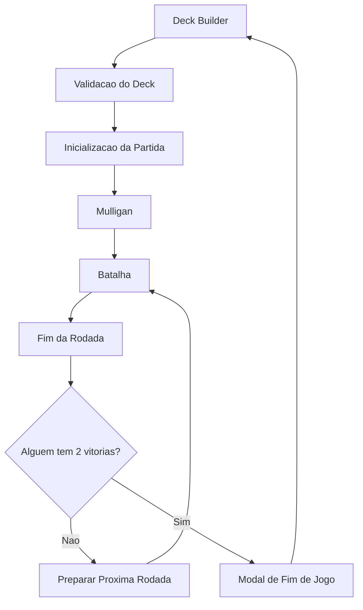

# Arquitetura

Kingdom of Aen roda como uma pagina estatica. O estado e compartilhado por variaveis globais e os scripts precisam ser carregados na ordem definida em `index.html`.

## Visao Geral



## Ordem dos Scripts

`index.html` carrega os arquivos nesta ordem:

1. `js/utils/helpers.js`
2. `js/data/cards.js`
3. `js/core/state.js`
4. `js/core/audio.js`
5. `js/core/abilities.js`
6. `js/core/leaders.js`
7. `js/core/ai.js`
8. `js/core/engine.js`
9. `js/ui/render.js`
10. `js/ui/interactions.js`
11. `js/ui/mulligan.js`
12. `js/deckbuilder.js`
13. `js/main.js`

Essa ordem e parte do contrato atual do projeto. Como os arquivos nao usam ES Modules, funcoes e constantes precisam existir globalmente antes de serem chamadas.

## Modulos

| Arquivo | Responsabilidade |
| --- | --- |
| `index.html` | Estrutura das duas cenas: deck builder e batalha. |
| `css/style.css` | Layout, cartas, tabuleiro, modais, animacoes, mulligan e deck builder. |
| `js/data/cards.js` | Dados de cartas, lideres, validacao de deck e helpers de colecao. |
| `js/utils/helpers.js` | Constantes de icones e descricoes de habilidades. |
| `js/core/state.js` | Estado global da partida, rodada, clima, cemiterios e mulligan. |
| `js/core/audio.js` | Musica, efeitos sonoros, cache de audio e mute persistido. |
| `js/core/abilities.js` | Habilidades de cartas: clima, medico, espiao, scorch e decoy. |
| `js/core/leaders.js` | Inicializacao, renderizacao, uso e IA dos lideres. |
| `js/core/ai.js` | Decisao do oponente por prioridades. |
| `js/core/engine.js` | Pontuacao, turnos, fim de rodada, fim de jogo e reset. |
| `js/ui/render.js` | Criacao visual das cartas e atualizacao de contadores. |
| `js/ui/interactions.js` | Drag and drop das cartas do jogador. |
| `js/ui/mulligan.js` | Fase de troca inicial de cartas. |
| `js/deckbuilder.js` | Montagem, filtros, estatisticas e persistencia do deck. |
| `js/main.js` | Inicializacao do jogo, controles principais e botao de audio. |

## Estado Global

O estado principal vive em `js/core/state.js`:

- `activeWeather`: clima ativo por fileira.
- `enemyHand`, `playerDeck`, `enemyDeck`: cartas em mao e decks restantes.
- `playerPassed`, `enemyPassed`, `isProcessingTurn`: controle de turno.
- `playerWins`, `enemyWins`: placar da partida.
- `playerGraveyard`, `enemyGraveyard`: cartas descartadas ou destruidas.
- `playerLeader`, `enemyLeader`: lideres da partida.
- `mulliganHand`, `mulliganRedraws`: estado temporario do mulligan.

O deck escolhido pelo jogador fica em `playerDeckIds`, definido em `js/deckbuilder.js`, e e salvo em `localStorage` com a chave `kingdomOfAen_playerDeck`.

## Fluxo de Inicializacao

1. `DOMContentLoaded` em `deckbuilder.js` chama `initDeckBuilder()`.
2. O deck salvo e carregado do `localStorage`.
3. A colecao e o deck sao renderizados.
4. `DOMContentLoaded` em `main.js` configura drag and drop, controles, lideres e audio.
5. Ao clicar em iniciar batalha, `startBattle()` valida o deck e chama `initializeGameWithDeck(playerDeckIds)`.
6. O jogador e o inimigo compram 10 cartas.
7. O mulligan inicia antes da batalha ficar jogavel.

## Contratos de Dados

Cada carta da colecao deve seguir este formato base:

```js
{
  id: "daniel_1",
  baseId: "daniel",
  name: "Daniel",
  type: "melee",
  power: 2,
  img: "img/personagens/Daniel.png",
  ability: "bond_partner",
  partner: "Gabriel",
  category: "unit"
}
```

Campos relevantes:

- `id`: identificador unico da copia.
- `baseId`: identificador da carta base.
- `type`: fileira principal: `melee`, `ranged` ou `siege`.
- `row: "all"`: carta agile, pode ir em qualquer fileira.
- `category`: `unit` ou `special`, usado principalmente pela validacao do deck.
- `ability`: habilidade lida por `triggerAbility()`.
- `isHero`: carta imune a clima e scorch.

## Pontos de Atencao

- `shuffleArray()` existe em `js/utils/helpers.js`. Em `js/data/cards.js` ja foi removida a duplicacao.
- `createDefaultDeck()` (deckbuilder) ja usa `category === 'unit'`, alinhado com os dados.
- A logica de remocao de especiais one-shot ja usa `dataset.category === 'special'`.
- Varias referencias de arte apontam para `assets/*.png`, pasta que nao existe atualmente. Ver [ASSETS.md](ASSETS.md).
- Algumas habilidades estao implementadas no motor (`weather_*`, `scorch`, `spy`, `tight_bond`), mas nao possuem cartas na colecao atual. Ver [GAME_RULES.md](GAME_RULES.md).
- Estado e funcoes vivem em escopo global (sem ES Modules). A ordem de scripts em `index.html` e o contrato implicito do projeto.

## Limites Atuais da Arquitetura

A arquitetura atual e ideal para um single-player local pequeno, mas tem fricoes para crescer:

- **Sem camada de rede.** Nao existe nenhum protocolo de mensagens, websocket, REST ou backend. Adicionar multiplayer exige extrair a logica de estado de variaveis globais (ver [MULTIPLAYER.md](MULTIPLAYER.md)).
- **Estado misturado com DOM.** `updateScore()` le o DOM como fonte de verdade. Para validacao server-side, a verdade do estado precisaria viver fora do DOM.
- **Sem testes.** Nao ha testes automatizados. Refatorar para multiplayer sem testes e arriscado.
- **Sem build step.** Falta de bundler dificulta usar libs (websockets, frameworks de UI). Migrar para Vite/ESBuild + ES Modules e um caminho natural antes de online.
