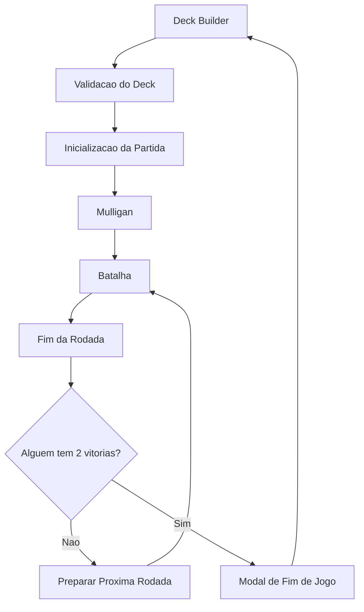

# Arquitetura

Kingdom of Aen roda como uma pagina estatica. O estado e compartilhado por variaveis globais e os scripts precisam ser carregados na ordem definida em `index.html`.

## Visao Geral



## Ordem dos Scripts

`index.html` carrega os arquivos nesta ordem:

1. `js/utils/helpers.js`
2. `js/domain/card.js`
3. `js/data/cards.js`
4. `js/core/state.js`
5. `js/core/audio.js`
6. `js/core/ai.js`
7. `js/core/engine.js`
8. `js/ui/render.js`
9. `js/ui/interactions.js`
10. `js/ui/mulligan.js`
11. `js/deckbuilder.js`
12. `js/main.js`

Essa ordem e parte do contrato atual do projeto. Como os arquivos nao usam ES Modules, funcoes e constantes precisam existir globalmente antes de serem chamadas.

## Modulos

| Arquivo | Responsabilidade |
| --- | --- |
| `index.html` | Estrutura das duas cenas: deck builder e batalha. |
| `css/style.css` | Layout, cartas, tabuleiro, modais, animacoes, mulligan e deck builder. |
| `js/data/cards.js` | Dados de cartas, validacao de deck e helpers de colecao. |
| `js/domain/card.js` | Definicoes e instancias canonicas, zonas, ownership e controle. |
| `js/utils/helpers.js` | Constantes de icones e descricoes de habilidades. |
| `js/core/state.js` | Estado global da partida, rodada, timers e mulligan. |
| `js/core/audio.js` | Musica, efeitos sonoros, cache de audio e mute persistido. |
| `js/core/ai.js` | Decisao do oponente por prioridades. |
| `js/core/engine.js` | Compra, pontuacao, turnos, fim de rodada, fim de jogo e reset. |
| `js/ui/render.js` | Criacao visual das cartas e atualizacao de contadores. |
| `js/ui/interactions.js` | Drag and drop das cartas do jogador. |
| `js/ui/mulligan.js` | Fase de troca inicial de cartas. |
| `js/deckbuilder.js` | Montagem, filtros, estatisticas e persistencia do deck. |
| `js/main.js` | Inicializacao do jogo, controles principais e botao de audio. |

## Estado Global

O estado principal vive em `js/core/state.js`:

- `enemyHand`, `playerDeck`, `enemyDeck`: cartas em mao e decks restantes.
- `playerPassed`, `enemyPassed`, `isProcessingTurn`: controle de turno.
- `playerWins`, `enemyWins`: placar da partida.
- `mulliganHand`, `mulliganRedraws`: estado temporario do mulligan.
- `pendingGameTimers`: tarefas assincronas pertencentes a sessao atual.

O deck escolhido pelo jogador fica em `playerDeckIds`, definido em `js/deckbuilder.js`, e e salvo em `localStorage` com a chave `kingdomOfAen_playerDeck`.

## Fluxo de Inicializacao

1. `DOMContentLoaded` em `deckbuilder.js` chama `initDeckBuilder()`.
2. O deck salvo e carregado do `localStorage`.
3. A colecao e o deck sao renderizados.
4. `DOMContentLoaded` em `main.js` configura drag and drop, controles e audio.
5. Ao clicar em iniciar batalha, `startBattle()` valida o deck e chama `initializeGameWithDeck(playerDeckIds)`.
6. O jogador e o inimigo compram 10 cartas.
7. O mulligan inicia antes da batalha ficar jogavel.

## Contratos de Dados

`CardDefinition` e a fonte imutavel de nome, poder, arte e habilidade. `CardInstance` referencia essa definicao e adiciona estado de runtime:

- `instanceId`: identidade unica e estavel durante toda a sessao.
- `definitionId` e `definition`: ligacao com a definicao original.
- `ownerId`: dono permanente da carta.
- `controllerId`: lado que controla a carta no momento.
- `zone`: `deck`, `mulligan`, `hand` ou `board`.
- `currentRow`: fileira ocupada quando a zona e `board`.

Transicoes retornam uma nova instancia imutavel, preservando identidade, definicao e ownership. O elemento visual mantem uma referencia direta em `cardInstance`; seus `data-*` sao apenas metadados de apresentacao durante a migracao do estado.

Cada carta da colecao deve seguir este formato base:

```js
{
  id: "daniel_1",
  baseId: "daniel",
  name: "Daniel",
  type: "melee",
  power: 2,
  img: "img/personagens/Daniel.png",
  ability: "bond_partner",
  partner: "Gabriel",
  category: "unit"
}
```

Campos relevantes:

- `id`: identificador unico da copia.
- `baseId`: identificador da carta base.
- `type`: fileira principal: `melee`, `ranged` ou `siege`.
- `row: "all"`: carta agile, pode ir em qualquer fileira.
- `category`: `unit`, usado pela validacao do deck.
- `ability`: `bond_partner` ou `hero` no recorte atual.
- `partner`: nome da unidade necessaria para ativar `bond_partner`.
- `isHero`: identifica unidades heroicas.

## Contratos de Execucao

- Uma sessao nova sempre cancela timers pertencentes a sessao anterior.
- A IA conclui toda a sua acao antes de liberar a entrada do jogador.
- Cartas sem arte cadastrada usam o fallback visual e nao apontam para arquivos inexistentes.
- Toda habilidade presente nos dados precisa ter regra alcancavel, descricao e cobertura de teste.
