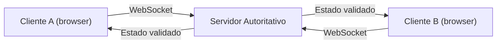

# Plano de Multiplayer Online

Este documento descreve a estrategia tecnica para transformar Kingdom of Aen, hoje single-player, em um jogo PvP online entre dois jogadores. E o detalhamento do marco **M4** do [ROADMAP.md](ROADMAP.md), com as preparacoes do **M3**.

> **Status atual:** o jogo nao tem nenhuma camada de rede. Tudo roda no navegador, contra uma IA local. Este e um plano, nao uma descricao do que ja existe.

## 1. Objetivo

Permitir que dois jogadores em maquinas diferentes joguem uma partida completa de Kingdom of Aen pelo navegador, com:

- Lobby para criar e entrar em sala (por codigo).
- Sincronizacao de turnos validada por servidor.
- Reconexao curta sem perder a partida.
- Encerramento confiavel em caso de desistencia ou timeout.
- Sem fraude trivial (cliente nao decide o resultado).

Fora de escopo nesta fase: ranking, matchmaking automatico, chat livre, espectador, replay.

## 2. Pre-requisitos (M3 - Refatoracao)

Antes de qualquer linha de rede, o codigo precisa estar pronto. Esses sao os pre-requisitos:

1. **Estado puro.** Hoje o estado vive em variaveis globais e o DOM e parcialmente fonte de verdade (`updateScore()` le o DOM). Para o servidor validar jogadas, o estado precisa ser um objeto serializavel.
2. **Acoes representadas como mensagens.** Toda jogada precisa virar um objeto descritivel: `{ type: 'PLAY_CARD', cardId, row }`, `{ type: 'PASS' }`, `{ type: 'USE_LEADER' }`, `{ type: 'DECOY', sourceId, targetId }`, `{ type: 'MULLIGAN_SWAP', index }`, `{ type: 'MULLIGAN_DONE' }`.
3. **Reducer puro.** Uma funcao `applyAction(state, action) -> newState` deve existir e ser testavel sem DOM.
4. **Camada de view.** O DOM passa a apenas ler `state` e renderizar. Drag-and-drop dispara acoes; nao manipula DOM diretamente para mudar logica.
5. **RNG controlavel.** Embaralhamento e selecoes aleatorias devem aceitar uma seed para reprodutibilidade.

Sem esses cinco itens, montar online vira gambiarra que vai quebrar na primeira partida real.

## 3. Arquitetura Proposta

### 3.1. Visao Geral

- Cada cliente envia **acoes** (intencoes do jogador).
- O servidor valida, aplica via reducer puro, e devolve o **estado novo** para os dois clientes.
- O cliente nunca decide quem ganhou. Ele so renderiza o que o servidor disser.

### 3.2. Servidor Autoritativo

Tres opcoes plausiveis, da mais simples para a mais flexivel:

#### Opcao A - Cloudflare Workers + Durable Objects (recomendada)

- Cada partida vira uma instancia de Durable Object.
- Estado da partida fica no proprio DO, sem banco de dados.
- WebSocket nativo, baixa latencia regional.
- Tier gratuito generoso para volume baixo.
- Trade-off: vendor lock-in com Cloudflare.

#### Opcao B - Supabase Realtime

- Usar canais Realtime do Supabase como transporte.
- Estado autoritativo num Edge Function (Deno) ou Postgres com RLS.
- Mais facil para integrar contas e persistencia futura.
- Trade-off: latencia maior que DO, mais complexidade.

#### Opcao C - Node.js + Colyseus (auto-hospedado)

- Framework Node especifico para jogos em tempo real.
- Mais controle, mais trabalho operacional.
- Custo de hospedagem fixo (Fly.io, Render, VPS).
- Trade-off: pago/operacao, mas portavel.

**Recomendacao:** comecar com Opcao A pelo custo zero e simplicidade. Migrar so se virar ruim.

### 3.3. Cliente

- Manter HTML/CSS/JS puro com bundler (Vite).
- Usar `WebSocket` nativo (sem libs pesadas) ou cliente do Colyseus se for Opcao C.
- Adicionar overlay de "conectando", "esperando oponente", "oponente desconectou".

## 4. Modelo de Mensagens

Sugestao inicial. Pode evoluir.

### Cliente -> Servidor

| Tipo | Payload | Quando |
| --- | --- | --- |
| `JOIN_LOBBY` | `{ nickname, deckIds }` | Apos clicar em "Online" |
| `CREATE_ROOM` | `{}` | Cria sala vazia |
| `JOIN_ROOM` | `{ roomCode }` | Entra em sala existente |
| `READY` | `{}` | Confirma deck e aguarda |
| `MULLIGAN_SWAP` | `{ handIndex }` | Troca uma carta no mulligan |
| `MULLIGAN_DONE` | `{}` | Fecha o mulligan |
| `PLAY_CARD` | `{ cardId, row, decoyTargetId? }` | Joga carta na fileira |
| `USE_LEADER` | `{}` | Aciona habilidade do lider |
| `PASS` | `{}` | Passa a rodada |
| `RECONNECT` | `{ roomCode, sessionToken }` | Volta apos queda |
| `DISCONNECT` | `{}` | Saida limpa |

### Servidor -> Cliente

| Tipo | Payload | Quando |
| --- | --- | --- |
| `ROOM_CREATED` | `{ roomCode, sessionToken }` | Resposta a `CREATE_ROOM` |
| `OPPONENT_JOINED` | `{ nickname }` | Outro jogador entrou |
| `STATE` | `{ state, turn, version }` | Estado completo apos cada acao |
| `ERROR` | `{ code, message }` | Acao invalida |
| `OPPONENT_DISCONNECTED` | `{ graceUntil }` | Oponente caiu, contador de gracinha |
| `OPPONENT_RECONNECTED` | `{}` | Voltou |
| `MATCH_END` | `{ winner, finalState }` | Fim oficial da partida |

## 5. Decisoes Importantes a Definir

Antes do primeiro commit de online, decidir explicitamente:

1. **Sem login no MVP.** Apenas nickname + sessionToken por sala. Login real fica para pos-1.0.
2. **Anti-cheat:** estado puro no servidor, cliente nunca recebe o deck do oponente embaralhado em claro. Servidor manda apenas `{ opponentHandSize }`, nao as cartas.
3. **Embaralhamento:** o servidor embaralha (seed propria). Cliente nao tem influencia.
4. **Mulligan simultaneo ou alternado?** Hoje so o jogador faz mulligan. Online: ambos fazem ao mesmo tempo, com timeout.
5. **Tempo por turno?** Recomendado. Sem timer, alguem pode travar a partida. Sugestao inicial: 60s por turno, +30s de banco.
6. **Reconexao:** janela de 60s para voltar. Apos isso, oponente vence por timeout.
7. **Versionamento de estado:** cada `STATE` carrega um numero `version`. Cliente que receber versao fora de ordem ignora.

## 6. Roadmap Resumido do Online

Quebrado em sub-marcos para nao virar tudo de uma vez:

### M4.1 - Hot-seat (PvP local no mesmo navegador)
- Apenas para validar a refatoracao de M3.
- Dois jogadores no mesmo PC, alternando turnos com tela de "passe o controle".
- Sem rede. Sem servidor. Mas ja com modelo de acoes.

### M4.2 - Eco em servidor (sem partida real)
- Subir o servidor escolhido (Cloudflare DO ou alternativa).
- Cliente conecta, manda mensagem, recebe eco. Prova que o transporte funciona.

### M4.3 - Lobby minimo
- Criar sala, entrar por codigo, ver "oponente conectado". Sem partida ainda.

### M4.4 - Partida basica
- Jogo completo com regras atuais, validacao no servidor, sem mulligan ainda.

### M4.5 - Mulligan e lider
- Adicionar mulligan simultaneo e habilidades de lider sincronizadas.

### M4.6 - Robustez
- Timeout, reconexao, tratamento de desistencia, mensagens de erro claras.

### M4.7 - Beta fechado com amigos
- Soltar para 4-6 amigos jogarem entre si por uma semana.
- Coletar bugs. Corrigir.

So apos M4.7 considerar o online "pronto" para o publico geral.

## 7. Custos Estimados (mensal)

Assumindo trafego baixo (dezenas de partidas por dia, no maximo):

| Componente | Plano | Custo aproximado |
| --- | --- | --- |
| Cloudflare Workers + Durable Objects | Free tier | R$ 0 |
| Hospedagem do front (GitHub Pages / Vercel / CF Pages) | Free tier | R$ 0 |
| Dominio proprio (opcional) | .com | R$ 50/ano |
| Sentry (logs de erro front) | Free tier | R$ 0 |

Total: praticamente zero ate o jogo virar popular. Se virar, escalar e barato no DO.

## 8. Riscos Tecnicos

- **Vendor lock-in com Cloudflare DO.** Mitigacao: manter o servidor com logica isolada (uma classe que pode rodar tambem em Node). Trocar plataforma vira porte de transporte, nao reescrita.
- **Latencia em partidas internacionais.** DO escolhe regiao automaticamente, mas se um jogador esta nos EUA e outro no BR, a regiao do criador domina. Mitigacao: medir e aceitar; o jogo nao e em tempo-real critico.
- **Pacotes perdidos / WebSocket flaky.** Mitigacao: usar `version` e `RECONNECT` com sessionToken.
- **Sincronizacao de animacoes.** O cliente recebe `STATE` novo, mas as animacoes locais demoram. Mitigacao: separar "estado logico" de "estado visual" e enfileirar animacoes.
- **Cheat por DevTools.** Cliente pode tentar mandar acoes invalidas. Mitigacao: servidor valida tudo. O DOM nunca decide o jogo.

## 9. Como Comecar (concretamente)

Quando o time decidir partir para isso, a primeira PR deve ser:

1. Criar diretorio `js/multiplayer/` (vazio por enquanto, so para reservar lugar).
2. Criar `docs/PROTOCOL.md` com o esquema de mensagens em formato JSON Schema.
3. Adicionar dependencia `vite` e migrar 1 arquivo para ES Modules como prova.
4. Escrever um teste unitario para `validateDeck()` com Vitest.

So depois disso comecar M3 de verdade. Esses passos sao baratos e ja descobrem 80% dos bloqueios.

## 10. Referencias Uteis

- Cloudflare Durable Objects + WebSockets: https://developers.cloudflare.com/durable-objects/
- Colyseus: https://docs.colyseus.io/
- Supabase Realtime: https://supabase.com/docs/guides/realtime
- Padroes de servidor autoritativo: https://gafferongames.com/post/what_every_programmer_needs_to_know_about_game_networking/
