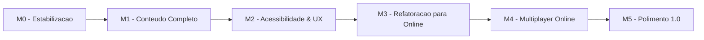

# Roadmap - Destino Final do Kingdom of Aen

Este documento descreve o **destino final** do projeto e o caminho ate la. E o "norte" para todas as decisoes. Detalhes operacionais (sprints curtos, debito tecnico) ficam em [SPRINTS.md](SPRINTS.md) e [IMPROVEMENTS.md](IMPROVEMENTS.md).

## Destino Final - Versao 1.0

A versao 1.0 e atingida quando os tres criterios abaixo se cumprem:

1. **Single-player completo:** todas as cartas com arte, todas as habilidades em uso, IA decente em todas as faccoes.
2. **Multiplayer online jogavel:** dois jogadores entram em uma sala pelo navegador, jogam ate o fim sem desincronizar e veem o vencedor.
3. **Estavel e acessivel:** sem bugs criticos, sem crashes em navegadores modernos, jogavel em desktop e mobile (paisagem).

Tudo alem disso e backlog pos-1.0.

## Mapa Geral em 6 Marcos

Os marcos sao sequenciais: cada um destrava o seguinte. Pular ordem aumenta retrabalho.

---

## M0 - Estabilizacao da Base

**Objetivo:** corrigir inconsistencias e debito tecnico simples antes de adicionar coisa nova.

**Status:** parcialmente concluido (Sprint 1 do plano antigo).

**Entregas:**
- [x] `createDefaultDeck()` usando `category === 'unit'`.
- [x] Remover duplicacao de `shuffleArray()`.
- [x] Logica de especiais one-shot alinhada com `category`.
- [x] Imagens reais no Deck Builder quando `card.img` existir.
- [x] Validador automatico em `scripts/validate-project.js`.
- [ ] Resolver caminhos `assets/*.png` (mover, criar pasta ou substituir por arte existente).
- [ ] Decidir o destino do audio duplicado `Medieval_Way__Knight_Mix_Original - Copia.mp3`.

**Saida:** projeto sem warnings do validador, sem placeholders visiveis em jogo.

---

## M1 - Conteudo Completo

**Objetivo:** entregar todas as cartas com arte, todas as habilidades com cartas ativas e todas as faccoes minimamente diferenciadas.

**Entregas:**
- [ ] Arte definitiva (ou placeholder oficial) para cada carta da `CARD_COLLECTION`.
- [ ] Cartas para `tight_bond`, `spy`, `scorch` e cartas climaticas (`weather_*`).
- [ ] Pelo menos 1 lider por faccao planejada com habilidade balanceada.
- [ ] Passivas das 4 faccoes (hoje so `alfredolandia` existe).
- [ ] Documento inicial de balanceamento (custo/poder esperado por fileira, peso de heroi, peso de combo).
- [ ] Revisao das prioridades da IA com as cartas novas.

**Saida:** o jogo single-player se sustenta sozinho, sem dependencia obvia de "vai melhorar quando tiver online".

---

## M2 - Acessibilidade & UX

**Objetivo:** o jogo deve ser confortavel para um jogador novo, em desktop e mobile.

**Entregas:**
- [ ] Tutorial guiado curto (uma partida fixa contra IA com dicas).
- [ ] Alternativa por clique para jogar carta (sem precisar arrastar).
- [ ] Atalhos de teclado para passar rodada e usar lider.
- [ ] Estados de foco visiveis (acessibilidade basica).
- [ ] Layout responsivo: tabuleiro reorganizado em telas pequenas, mao com rolagem confortavel.
- [ ] Feedback visual e sonoro consistente em todos os efeitos.
- [ ] Configuracao de volume (musica e SFX separados).

**Saida:** o jogo passa em um teste de "primeira vez" com alguem que nunca jogou Gwent.

---

## M3 - Refatoracao para Online

**Objetivo:** preparar o codigo para servidor autoritativo sem reescrever tudo.

E o marco mais tecnico e o mais arriscado se for pulado. Sem ele, o online vira gambiarra.

**Entregas:**
- [ ] Migrar para ES Modules + bundler leve (Vite).
- [ ] Extrair o estado para um objeto unico, deixando o DOM como camada de visualizacao (e nao fonte de verdade).
- [ ] Tornar `updateScore()` puro (recebe estado, retorna numeros, sem ler DOM).
- [ ] Tornar habilidades puras quando possivel (estado entra, estado novo sai).
- [ ] Suite minima de testes: validacao de deck, calculo de pontuacao, decisao da IA.
- [ ] Modo "hot-seat" (multiplayer local no mesmo navegador), funcionando como prova de que o estado e portavel sem rede.

**Saida:** mesma experiencia atual, mas com codigo testavel e estado puro. Hot-seat e um bonus que valida o caminho.

---

## M4 - Multiplayer Online

**Objetivo:** dois jogadores em maquinas diferentes jogam uma partida do inicio ao fim.

Detalhes tecnicos completos em [MULTIPLAYER.md](MULTIPLAYER.md). Resumo das entregas:

- [ ] Backend leve com servidor autoritativo (Node + Cloudflare Workers Durable Objects, ou Supabase Realtime, ou Colyseus).
- [ ] Lobby simples: criar sala, entrar por codigo, ver oponente.
- [ ] Sincronizacao de turnos com mensagens validadas no servidor.
- [ ] Reconexao curta (perde wifi por 30s, volta sem perder a partida).
- [ ] Tratamento de desistencia / timeout / oponente offline.
- [ ] Anti-cheat basico: o servidor decide o resultado, o cliente so renderiza.

**Saida:** uma partida online de cabo a rabo, com dois amigos em redes diferentes.

---

## M5 - Polimento 1.0

**Objetivo:** preparar para lancamento publico.

**Entregas:**
- [ ] Testes manuais de regressao em Chrome, Firefox, Safari, Edge.
- [ ] Pagina de creditos.
- [ ] Configuracao de PWA basica (instalavel, icone).
- [ ] Checklist de release escrito e seguido.
- [ ] Logging minimo de erros do cliente (Sentry gratuito ou similar).
- [ ] Politica de privacidade simples (mesmo sem login real).
- [ ] Deploy estavel (dominio proprio ou subdominio fixo).

**Saida:** versao 1.0 publica, divulgavel para amigos e redes sociais sem medo.

---

## Pos-1.0 (backlog que nao bloqueia o destino final)

Ideias que nao sao parte do "destino final" mas podem entrar depois se houver tempo:

- Ranking e MMR (matchmaking competitivo).
- Cosmeticos: trocar dorso da carta, tabuleiro tematico.
- Espectador: terceiro jogador entra so para ver.
- Replay: salvar uma partida e revisar.
- Mais faccoes alem das 4 planejadas.
- Eventos sazonais (carta tematica de Natal, etc.).
- Discord bot integrado (matchmaking pelo Discord).
- Internacionalizacao (i18n para EN, ES alem de PT-BR).

Tudo isso e secundario. O foco e atravessar M0 -> M5 sem desviar.

---

## Como Usar Este Roadmap

- Antes de comecar uma sprint, conferir em qual marco a tarefa se encaixa.
- Se uma ideia nao se encaixa em M0-M5, ela vai para pos-1.0 ou para "fora de escopo" em [SCOPE.md](SCOPE.md).
- Marcos podem ter sprints internos. Sprints curtos viram tasks em [SPRINTS.md](SPRINTS.md).
- Atualizar este documento quando um marco fechar (mover entregas para `[x]` e abrir o proximo).

## Riscos Conhecidos

- **Refatoracao de M3 pode estourar prazo.** Codigo atual mistura DOM com estado. Mitigacao: fazer modulo por modulo, manter o single-player funcionando o tempo todo.
- **Custo de hospedagem do online.** Servidor autoritativo nao roda em GitHub Pages. Mitigacao: comecar com tier gratuito (Cloudflare Workers, Supabase free).
- **Balanceamento das cartas novas.** Adicionar `scorch` e `weather_*` muda a meta-game. Mitigacao: documento de balanceamento em M1, antes de soltar para amigos.
- **Manutencao de lista de personagens reais.** Algumas cartas tem nome de pessoas conhecidas. Mitigacao: pedir consentimento informal antes de publicar.
